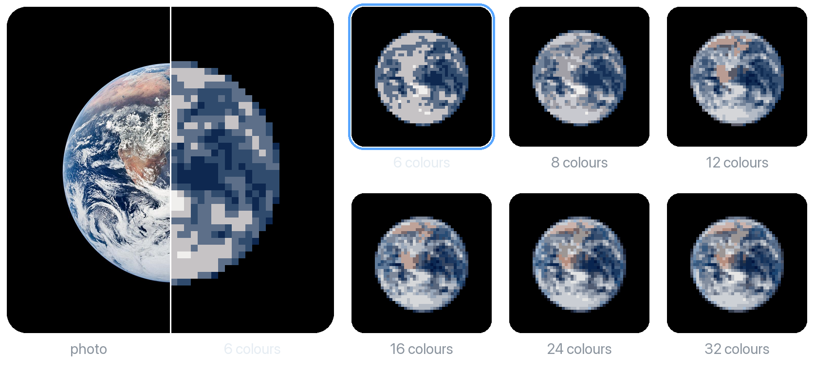
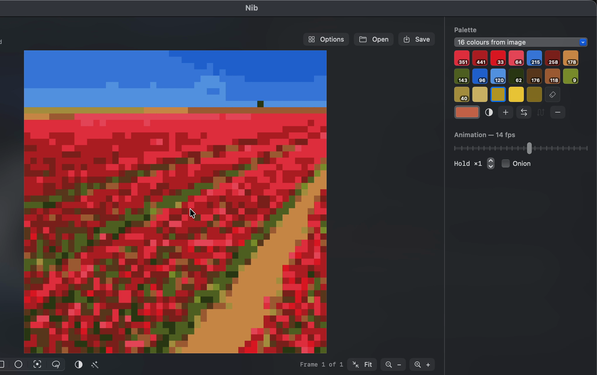
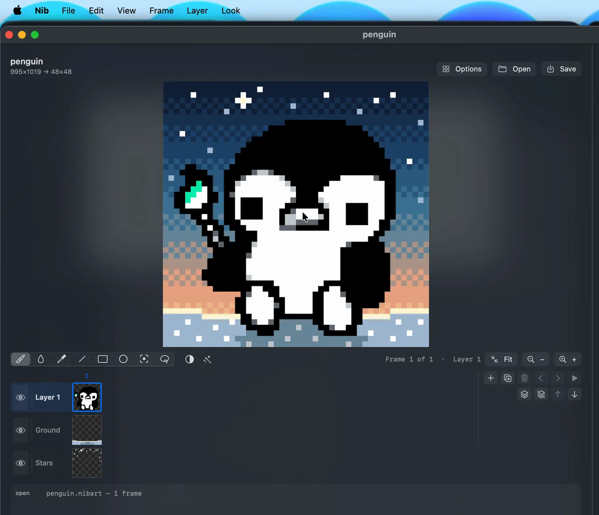

<p align="center">
  
</p>

<h1 align="center">Nib</h1>

<p align="center">
  <b>A pixel art editor for macOS</b>
</p>

<p align="center">
  
  
  
</p>

<p align="center">
  <a href="#import">Import</a> ·
  <a href="#draw">Draw</a> ·
  <a href="#animate">Animate</a> ·
  <a href="#work-with-claude-">Work with Claude</a> ·
  <a href="#install">Install</a>
</p>

Nib is an open source pixel art editor I made when I got bored. Open a drawing
or a photo and it turns it into a spread of pixel art versions. Pick one, edit
it, animate it, and export a PNG or a GIF.

<p align="center">
  
  <br>
  <sub>A photo through the colour ladder: one import, six palettes, from 6 colours to 32.</sub>
</p>

---

## Import

<p align="center">
  
</p>

Works on doodles and photos alike. Nib shows every version side by side and
you pick one.

- **Line art:** twelve versions, three stroke weights by two to five tones.
- **Colour:** six versions, from 6 to 32 colours.
- **Crop:** drag a square on the original to choose what gets converted.

---

## Draw

Pencil, fill, eyedropper, line, rectangle, ellipse, marquee and lasso
selection, with cut, copy, paste, flip and rotate. Live mirror symmetry, a grid
overlay, a tile preview for patterns that repeat, and fifty levels of undo.

<p align="center">
  
</p>

The palette panel shows how many pixels use each colour. Add shades, change any
colour and every pixel using it follows, or switch to a new palette without
losing your edits.

---

## Animate

<p align="center">
  
</p>

Frames across, layers down, in one timeline: click any cell to go straight to
that frame and layer. Per-frame holds, onion skin up to three frames either
side, copy and paste whole frames, and GIF export.

**Roll Across Frames** turns one frame into a loop where one layer moves and the
rest stay still. The header was made this way: only the stars layer rolls, one
cell per frame, for 48 frames.

---

## Work with Claude 

Nib comes with an MCP server, so Claude can edit your drawings, either a saved
file or the window you have open.

> Hey Claude, working on something in nib. Can you generate me three new
> "starry night" backgrounds behind the penguin?

<p align="center">
  
</p>

> Liking option 3, can we make some of those stars slightly smaller? Then apply
> it in Nib.

<p align="center">
  
</p>

- Options come back as a sheet; nothing changes until you pick one.
- Every change is one undo step.
- If you draw while it works, your strokes are kept and its edit is redone.

Connect it to Claude Code (needs [uv](https://docs.astral.sh/uv/)):

```bash
claude mcp add nib -- uv run --directory /path/to/nib/nib-mcp server.py
```

---

## Install

Needs macOS 14 or later, Xcode or its Command Line Tools
(`xcode-select --install`), and Python 3 with Pillow.

```bash
brew install pillow numpy
git clone https://github.com/jordanpainter/nib.git
cd nib
./bundle.sh
open build/Nib.app
```

Without Homebrew, `python3 -m pip install --user pillow numpy` works too. Nib
finds a Python with Pillow on its own: Homebrew's, conda or miniforge, or the
system one.

`./bundle.sh` builds `Nib.app` with its icon and its Python helper inside, so
you can drag it to Applications. For development, `swift build` and
`.build/debug/Nib` work too, optionally followed by a file to open.

`numpy` is optional. Without it, export looks are unavailable and colour
palettes fall back to a simpler method that can lose small vivid details.

Projects are `.nibart` files: plain JSON holding the layers, every frame, the
palette and the import settings.

---

## How it is built

```
Swift app  ──JSON lines over a Unix socket──▶  nibd  ──▶  Pillow
    ▲
    └──────  JSON lines over a Unix socket  ──  nib-mcp  ◀──  your Claude
```

The app is SwiftUI and AppKit. The image work lives in `nibd`, a long-lived
Python process, because Pillow does the reduction better than anything Swift
offers without pulling in a framework. `nib-mcp` sends Claude's edits to the
open window as whole documents, so the app keeps no second copy of any tool.

| | |
|---|---|
| `Sources/Nib/` | the app: canvas, timeline, tools, state |
| `nibd/` | quantiser, palette extraction, GIF encoding, effects, looks |
| `nib-mcp/` | the MCP server: tools for Claude, and the live link to the window |
| `docs/` | [what every control does](docs/FUNCTIONALITY.md) |

---

## Licence

The code is MIT; see [`LICENSE`](LICENSE). The artwork in `docs/media` is not
covered by the licence.

<sub>Nib is an independent project, not affiliated with, endorsed by or sponsored
by Anthropic. Claude and Clawd are trademarks of Anthropic. The Clawd in this
README is fan art, drawn in Nib. The Earth is NASA's Blue Marble photograph,
public domain. The tulip field photo is by Filio, CC0, via Wikimedia Commons.</sub>
