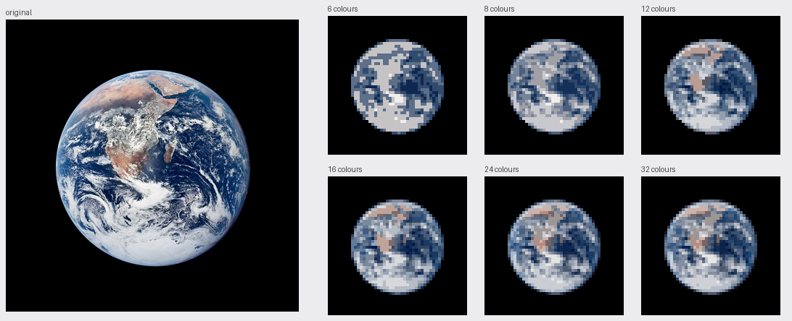
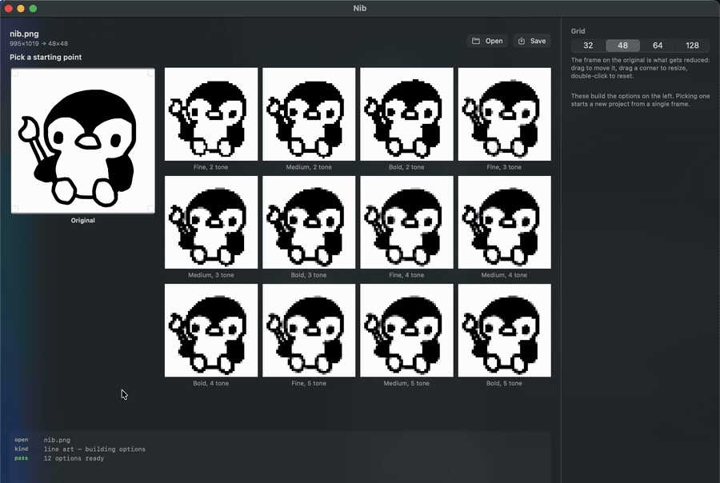
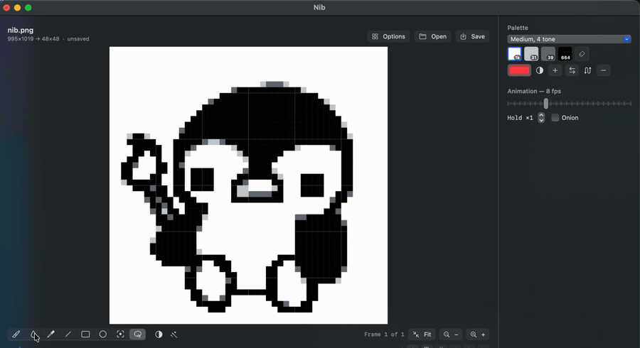
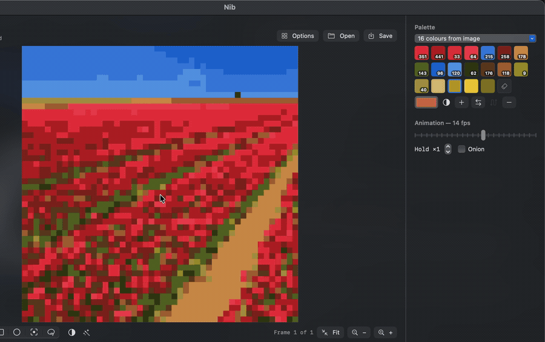
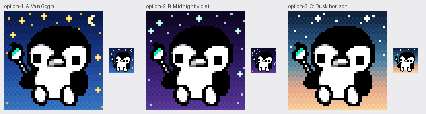
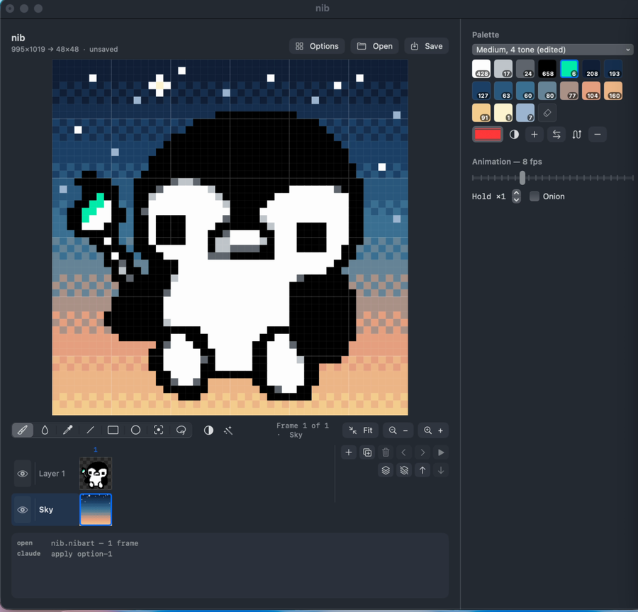

<p align="center">
  
</p>

<h1 align="center">Nib</h1>

<p align="center">
  <b>A pixel art editor for macOS that imports images well, and animates them.</b>
</p>

<p align="center">
  
  
  
</p>

<p align="center">
  <a href="#import">Import</a> ·
  <a href="#draw">Draw</a> ·
  <a href="#animate">Animate</a> ·
  <a href="#work-with-claude">Work with Claude</a> ·
  <a href="#install">Install</a>
</p>

Open a drawing or a photo and Nib offers you a spread of reductions to choose
from rather than guessing once. Pick one, edit it by hand, add layers and
frames, and export a PNG, a GIF or a macOS icon.

<p align="center">
  
  <br>
  <sub>A photo through the colour ladder: one import, six palettes, from 6 colours to 32.</sub>
</p>

The penguin above was imported and edited in Nib.

---

## Import

<p align="center">
  
</p>

Every parameter worth tuning turned out to be right for some drawings and wrong
for others. A bold marker wants less stroke thickening; a light pen needs more.
More greys rescue one subject and dirty another. There is no setting that works
everywhere, so Nib builds a spread and lets you point at one.

- **Line art:** twelve options, three stroke weights by two to five tones. Thin
  strokes are bridged, so they never arrive dotted.
- **Colour:** a ladder from 6 to 32 colours, with palettes that keep small vivid
  details instead of averaging them into mud.
- **A crop frame** on the original: drag to move, pull a corner to resize, and
  the options rebuild when you let go. Nothing is ever stretched.

---

## Draw

Pencil, fill, eyedropper, line, rectangle, ellipse, rectangle and lasso
selection, with cut, copy, paste, flip and rotate. Live mirror symmetry, a grid
overlay, a tile preview for patterns that repeat, and fifty levels of undo.

<p align="center">
  
</p>

The palette panel counts every colour's pixels, builds shading ramps that lean
warm or cool instead of just going darker, and swaps whole palettes by
remapping to the nearest colour, so your edits survive it.

<p align="center">
  
</p>

---

## Animate

Frames across, layers down, in one timeline: click any cell to go straight to
that frame and layer. Per-frame holds, onion skin up to three frames either
side, copy and paste whole frames, and GIF export.

**Roll Across Frames** turns one frame into a loop where a single layer moves
and the rest hold still. That is how the header works: four layers (sky,
stars, snow, penguin), and only the stars roll, one cell per frame for 48
frames, which is exactly one lap of the canvas, so the loop has no seam.

---

## Work with Claude 

Nib comes with an MCP server, so your own Claude session can work on your
drawings: on a saved file, or **live in the window you have open**.

> Hey Claude, working on something in nib. Can you generate me three new
> "starry night" backgrounds behind the penguin?

<p align="center">
  
</p>

> Liking option 3, can we make some of those stars slightly smaller? Then apply
> it in Nib.

<p align="center">
  
</p>

It lands in the window as one undo step, on its own layer, with a line in the
log saying Claude did it.

- **It offers, you choose.** Anything with more than one reasonable answer
  comes back as a labelled sheet, tried on copies. Your canvas only changes
  when you pick.
- **Every change is one undo step.** `⌘Z` takes back anything it did.
- **Your drawing wins.** Draw while it is working and its next edit is refused
  rather than applied over your strokes; it looks again and redoes it.
- **An assistant, not the artist.** It does the mechanical work: backgrounds,
  palettes and shading ramps, recolours, centring, separating a layer, rolling
  it across frames, icons, exports. The drawing is yours.

It works through layers, frames, palette, selection, gradients, transforms and
export. Connect it to Claude Code with
[uv](https://docs.astral.sh/uv/) installed:

```bash
claude mcp add nib -- uv run --directory /path/to/nib/nib-mcp server.py
```

---

## Install

Needs macOS 14 or later, Swift 5.10 or later, and Python 3 with Pillow.

```bash
git clone https://github.com/jordanpainter/nib.git
cd nib
python3 -m pip install pillow numpy
./bundle.sh
open build/Nib.app
```

`./bundle.sh` builds `Nib.app` with its icon and its Python helper inside, so
you can drag it to Applications. For development, `swift build` and
`.build/debug/Nib` work too, optionally followed by a file to open.

`numpy` is optional. Without it, export looks are unavailable and colour
palettes fall back to a simpler method that can lose small vivid details.

Projects are `.nibart` files: plain JSON holding the layers, every frame, the
palette and the import settings.

---

## How it is built

```
Swift app  ──JSON lines over a Unix socket──▶  nibd  ──▶  Pillow
    ▲
    └──────  JSON lines over a Unix socket  ──  nib-mcp  ◀──  your Claude
```

The app is SwiftUI and AppKit. The image work lives in `nibd`, a long-lived
Python process, because Pillow does the reduction better than anything Swift
offers without pulling in a framework. `nib-mcp` sends Claude's edits to the
open window as whole documents, so the app keeps no second copy of any tool.

| | |
|---|---|
| `Sources/Nib/` | the app: canvas, timeline, tools, state |
| `nibd/` | quantiser, palette extraction, GIF encoding, effects, looks |
| `nib-mcp/` | the MCP server: tools for Claude, and the live link to the window |
| `docs/` | [what every control does](docs/FUNCTIONALITY.md) |

---

## Licence

MIT. See [`LICENSE`](LICENSE).

<sub>Nib is an independent project, not affiliated with, endorsed by or sponsored
by Anthropic. Claude and Clawd are trademarks of Anthropic. The Clawd in this
README is fan art, drawn in Nib. The Earth is NASA's Blue Marble photograph,
public domain. The tulip field photo is by Filio, CC0, via Wikimedia Commons.</sub>
