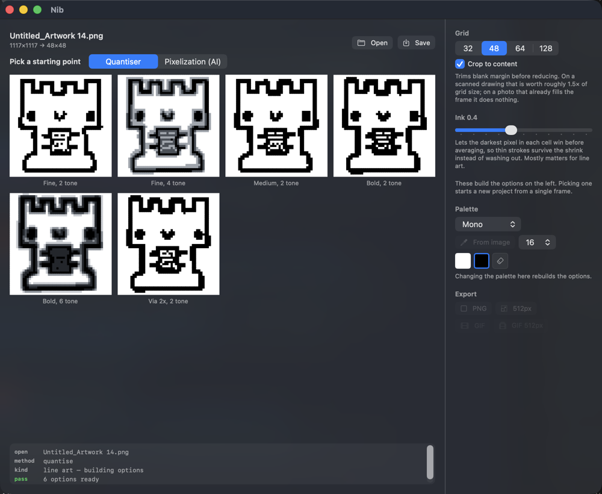
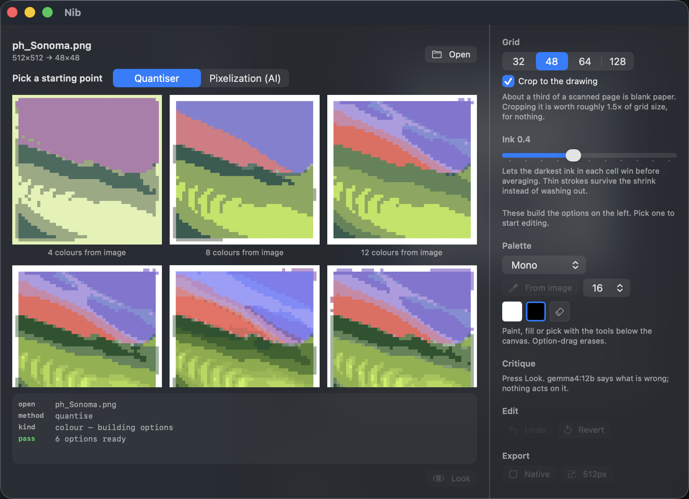
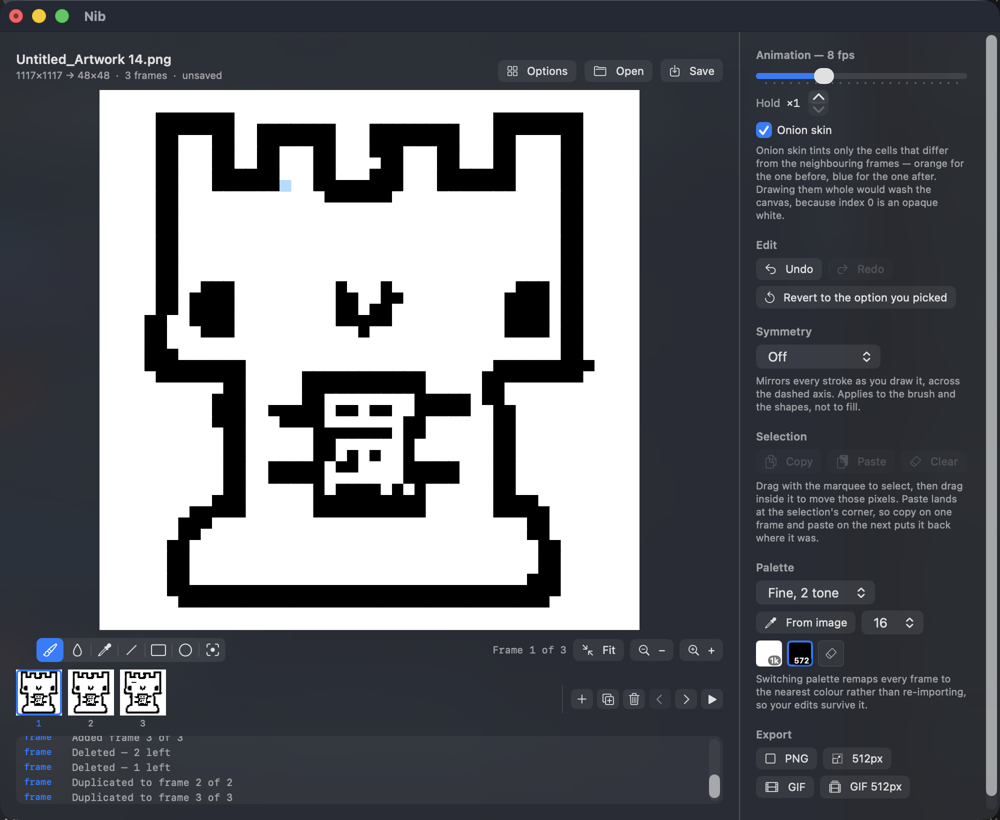
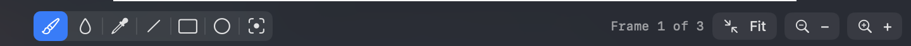
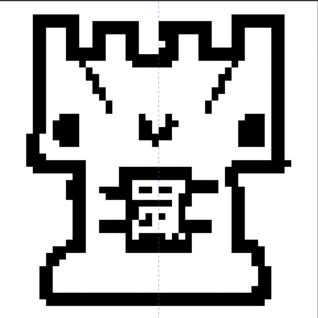
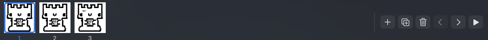
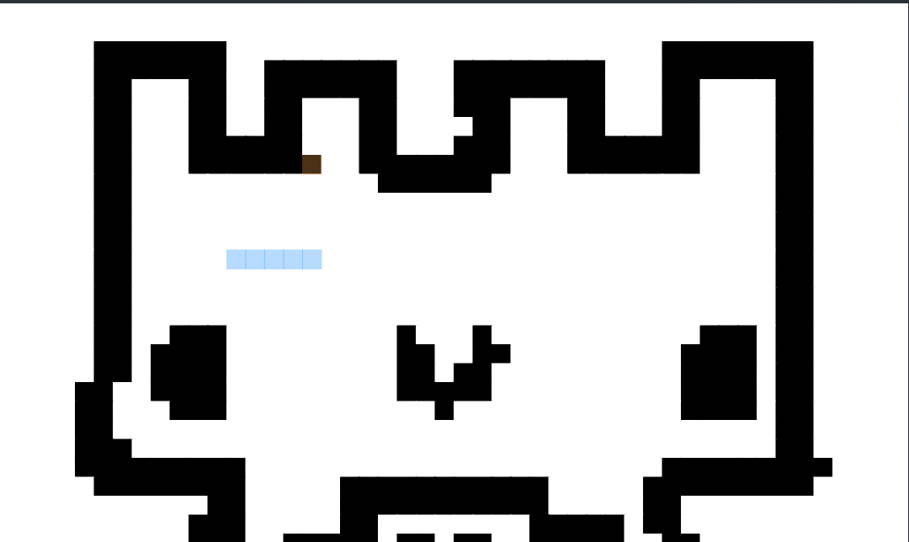
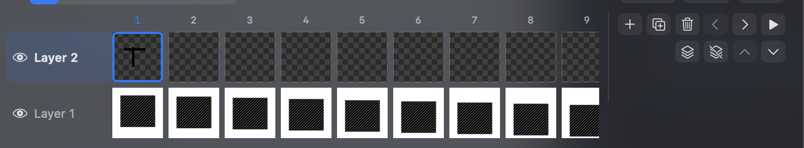
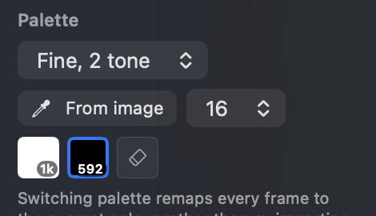
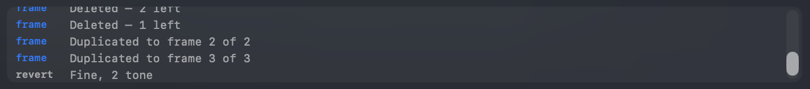

# What everything in Nib does

Nib turns a drawing or photo into pixel art, lets you edit it by hand, and
animates it. This covers the parts whose behaviour is not obvious from the label.

---

## 1. Import: pick a starting point

Open an image and Nib builds **six options** rather than guessing once, streaming
them in as they are produced. Click one to load it onto the canvas.

This is the core idea of the app. Every setting we measured turned out to be
right for some drawings and wrong for others: a bold marker wants less stroke
thickening, a light pen needs more. There is no single setting that works
everywhere, so Nib offers a spread and lets you point.

**Options** (top right, once you have picked) returns to the spread at any time.
Your canvas is untouched by browsing.

> **Importing an image replaces the whole project.** One project is one source
> drawing, and the frames are what you build from it by hand. If you have work
> open, Nib says how many frames are at stake and offers to save first.

### Method

Every option comes from Nib's own quantiser, built in and instant (about half a
second for the whole spread). There is no AI in the import; see DECISIONS for
why.

> On **colour** images the AI method is offered but measured *worse* than the
> quantiser — it invents structure that is not in the source and leaves a pale
> fringe round the edges. Use the quantiser for photographs.

### Grid

The output size: 32, 48, 64 or 128 cells square.

8 and 16 were removed because nothing survives the reduction at those sizes. 48
is the default and tends to be the sweet spot — cropped 48 beats uncropped 64 for
most drawings while still reading as pixel art, which 128 does not.

### Crop to content

Trims blank margin before reducing.

Across a set of scanned doodles the subject filled 59–84% of the page, so about a
third of every reduction was being spent on paper. Cropping that away is worth
roughly **1.5× of grid size for nothing** — a cropped 32 is effectively a 47.

On a photo that already fills the frame it does nothing. It works best when the
subject is reasonably framed; it is a stated expectation rather than something
Nib tries to guess.

On by default. Turn it off (the checkbox under **Grid**, visible while the
options are showing) to keep the whole image, margins and all; Nib remembers
that choice for later imports. A saved project keeps its own setting.

### Ink

How much a stroke survives being shrunk.

A pen line a few pixels wide in a 1000px drawing covers a fraction of one cell at
48×48, so plain averaging turns it into pale grey and it disappears. Ink bias
runs a halving pyramid of minimum filters first, so the **darkest** pixel in each
neighbourhood survives every step and thin lines reach the bottom intact.

On a two-colour palette it becomes a coverage threshold instead: literally *how
much of this cell must be ink for the cell to be ink*. Lower values give thinner
strokes.

It matters most for line art. Bold pens want less, light pens need more — this is
the setting that varies most between drawings, which is why the spread sweeps it
for you.

**Fine, 3 tone** is two coverage thresholds at once: a cell is black where Fine
would ink it (35% coverage), grey where only Bold would (15%), white otherwise.
So the grey lands only on cells a stroke half-fills, and the outline stays
solid black rather than picking up the grey halo that averaging paints round
every edge in the 4 and 6 tone options.

**Adaptive, 4 tone** in the spread varies the bias *within* one drawing. One
global value cannot serve both an outline and the detail inside it: at 0.8 the
castle's outline is crisp and its scroll collapses into a blob; at 0.4 the scroll
survives and the outline goes grey. The adaptive option measures how busy each
neighbourhood is and thickens only where thickening will not close a gap that
should stay open. Measured across fourteen drawings: clearly better where detail
is dense, neutral on plain outlines. There the Ink slider is a *ceiling* rather
than a constant.

### Colour images

Nib classifies the source on open and says which in the log. Line art gets
options varying stroke weight and tone depth; colour gets options varying
**palette size**, from 4 to 24 colours extracted from the image itself.

Palette extraction matters more than any other control on colour input. The same
gradient through a fixed palette came out yellow and cyan; through a palette
taken from the image it is near-indistinguishable from the original.

---

## 2. The canvas

### Tools

| Tool | Key | What it does |
|---|---|---|
| **Paint** | `B` | Draw with the selected colour. Drag to keep drawing. |
| **Fill** | `G` | Flood fill the contiguous region of matching colour. |
| **Pick** | `I` | Eyedropper — set the selected colour from the canvas. |
| **Line** | `L` | Drag from one end to the other. |
| **Rectangle** | `R` | Drag a box. |
| **Ellipse** | `E` | Drag the box it fits inside. |
| **Select** | `M` | Drag a rectangle, then drag inside it to move those pixels. |

The half-circle button at the end of the tool bar is **symmetry**. It tints when
it is on, because a mirroring brush you have forgotten about is a nasty surprise.

Option-drag erases to transparent with any tool.

Rectangle and ellipse draw an outline unless **Filled** is ticked, which appears
beside the tools when one of them is active.

**Shapes preview while you drag** and commit when you let go, from the same
call — so what you saw is exactly what lands.

**Fill is 4-connected, not 8.** Diagonal fill leaks straight through the corner
gaps in a one-pixel outline and floods the whole sprite, so it deliberately does
not travel diagonally.

**Pick does not consume an undo**, since it changes no pixels. Picking a
transparent cell selects the eraser, which is what you mean by it.

### Effects and gradient fill

The wand at the end of the tool bar. Everything in it **rewrites the cells of the
active layer** and appends whatever colours it needs to the palette, so nothing
already on the canvas changes meaning, and each is one undo.

**Gradient fill…** — two colours, four directions (Down / Across / Diagonal /
Radial), a band count and an optional dither. Fills the **selection** if you have
one, the whole cel otherwise; the sheet says which before you commit.

Bands rather than a smooth ramp, because the output is a palette-indexed grid: a
"smooth" gradient would just be a great many bands, spending the palette to look
like something it cannot be. Dither is the softener instead — a 4×4 ordered
checkerboard between bands, which is how pixel art has always done it. Ordered
rather than error-diffusion: on a flat ramp ordered gives a regular weave that
reads as texture, while error diffusion scatters and reads as dirt.

| Effect | What it does |
|---|---|
| **Scanlines** | Darkens every other row of cells. |
| **Glow** | Blends each cell toward its brightest neighbour, so bright areas halo. |
| **Colour fringe** | Red from the cell left, blue from the cell right — chromatic aberration one cell wide, only where neighbours differ. |
| **CRT** | Fringe, then glow, then scanlines, kept to a 28-colour budget. |
| **Prism** | The same with the fringe at full strength everywhere and no budget. Loud. |

These run at **cell** resolution, which is what separates them from the export
Looks. A Look works at 3-pixel pitch inside a 768px render and cannot exist in a
grid; these are made of real cells you can carry on drawing on.

### Selection

Drag with the marquee to select, then **drag inside it to move those pixels** —
live, leaving transparency behind. Copy (`⌘C`), cut (`⌘X`), paste (`⌘V`), select
all (`⌘A`) and clear (`⌫`) are in the Edit menu.

Paste lands at the **current selection's top-left corner**, or 0,0 if there is
none. So select all, copy, move to the next frame and paste puts the sprite back
exactly where it was — which is the whole workflow for hand-tweening.

**Lasso** (`Q`) selects any shape: drag round it and let go, and it closes
itself. Everything above works on it: move, cut, clear, copy and paste (which
keep the shape, so a paste does not wipe the pixels around it), flip, rotate and
the gradient fill.

### Flip and rotate

**Flip Horizontal** (`⇧⌘H`), **Flip Vertical** (`⇧⌘V`), **Rotate Clockwise**
(`⌘]`) and **Rotate Anticlockwise** (`⌘[`), in the Edit menu. They act on the
selection if there is one, otherwise the whole frame, and like Roll only on the
**active layer**. A non-square selection rotates about its centre, and the
selection follows it.

### Grid

**View → Show Grid** (`⌘'`) draws a line between cells, with every eighth line
heavier so a 64 can be counted in eights. It hides itself when cells get too
small to see between. Remembered across launches.

### Tile preview

**View → Tile Preview** (`⌘T`) draws the canvas 3×3. Only the middle copy is
editable (outlined); the eight around it are mirrors of it, so a seam in
something meant to wrap shows while you draw. Off at every launch, since it
shrinks the canvas to a third.

### Symmetry

Mirrors every stroke across a dashed axis **as you draw it**: left/right,
top/bottom or both. This is the one that earns its keep on faces. It lives in the
tool bar, because it is a drawing mode rather than a setting.

It applies to the brush and the shape tools. Not to fill — a mirrored flood fills
whatever happens to be on the other side, which is as likely to be wrong as right.

### Zoom

**Fit** scales the canvas to the window. **−** and **+** switch to a fixed cell
size with scrollbars, which you want at 64 and 128 where the cells get too small
to hit reliably.

### Undo, redo and revert

These are menu commands, not panel buttons. **Undo** (`⌘Z`) and **Redo** (`⇧⌘Z`) work per *stroke*, not per pixel: a whole
drag is one step, and so is adding, deleting or reordering a frame. 50 deep.

**Revert** restores the option you picked, for the frame you are on, discarding
every hand edit to it. It does not re-run the import — that would return a
different-looking sprite, since it would take the averaging path even if your
option came from the threshold one. It keeps working after a reload, because the
option you picked is saved in the project.

---

## 3. Frames and animation

The strip under the canvas is the timeline. Click a frame to edit it; the buttons
add a blank frame, duplicate this one, delete it, move it earlier or later, and
play the animation in the canvas.

**Duplicate is the one you want most of the time** — draw a pose, duplicate it,
nudge it.

### Speed and hold

One **frame rate** for the animation, and a per-frame **hold** of 1 to 8 ticks
for a pose that should sit longer. A frame held more than once shows its
multiplier in the strip. Both are used for playback and written into the GIF.

### Onion skin

Tints **only the cells that differ** from the neighbouring frames: orange for
frames before, blue for frames after. The stepper beside the checkbox shows 1 to
3 frames either side, each further one fainter, so a movement reads as a trail.
Only cells where the other frame actually has something are tinted, so the
current frame's own drawing is never washed over.

A conventional onion skin draws the whole neighbouring frame faintly, which works
when the background is transparent. Nib's imports have an opaque white as palette
index 0, so that would wash the entire canvas. Drawing the difference shows what
moved, which is what you opened it to see.

### Roll

Shifts the whole frame and **wraps**: what leaves one edge arrives at the other,
so nothing is lost. This is the difference between rolling and selecting — a
selection move pushes content off the edge and leaves transparency behind, which
costs you a row every frame.

**⌥ and an arrow key** rolls the current frame one step, and the same four are in
the Frame menu. **Frame → Build a Scrolling Run…** opens a sheet that turns one
frame into a scrolling run and replaces the animation with it. One undo.

The sheet tells you, before you commit, whether the loop will actually close.

| Mode | What you get |
|---|---|
| **Keep going** | A continuous scroll. Seamless only when frames × step carries the picture exactly once round. |
| **Back and forth** | Out and back — a triangle. Two frames is a twitch, six is a sway. Loops at any count. |

**Full turn** sets the count that closes the loop (grid size ÷ step) and switches
to Keep going. That is the setting for a scrolling background.

> **The join is the picture's problem, not the tool's.** A wrapping scroll is
> only invisible if the art tiles — if the top row genuinely continues into the
> bottom one. Most photographs and wallpapers do not, so the join rides through
> the frame once per loop. Either fix that band by hand once in the editor, or
> use art that tiles.

---

## 4. Layers

The strip under the canvas is a grid: **frames across, layers down**. With one
layer it is exactly the filmstrip it replaces; the layer gutter only appears once
there is a second layer, so you never pay for layers you have not asked for.

- **Click a cel** to work on that layer of that frame. **Click a layer name** to
  switch layer without changing frame; **double-click** it to rename.
- **The eye** hides a layer. Hidden layers are dimmed in the timeline, drop out of
  the canvas, and drop out of exports.
- The buttons on the right are frames on the top row and layers on the bottom:
  add, delete, and move up or down the stack.

The canvas always shows **every visible layer flattened**. Your tools always write
to **the one cel you have selected**. That split is the whole of what layers are.

### Why this matters for Roll

Rolling acts on the **active layer only**. Put a background on the bottom layer
and a sprite on top, select the background, and roll it: the background scrolls
and the sprite stands still on it. **Frame → Build a Scrolling Run…** does the
same across many frames at once, carrying every other layer through untouched.

That is parallax, and it is the reason to have layers at all in an app this size.

---

## 5. Palette

The swatches are both the colour picker and a **pixel census** — the number on
each swatch is how many cells in the current frame use it.

Those counts are the quickest read on whether a palette suits a subject. Six
greys spreading 350 pixels across four mid-tones is a halo round every edge; two
colours splitting 832/192 is a clean line.

**One palette serves the whole project.** Frames share indices, so copying between
them means the same thing in both, and a colour change ripples through the
animation.

**Switching palette remaps every frame** to the nearest colour in Lab. It does
*not* re-import, so your edits and your frames survive it.

**From image** runs median cut over the source at 4, 8, 16 or 32 colours and
switches to that palette.

The eraser swatch at the end paints transparency.

### Adding, changing and removing colours

The colour well and the three buttons under the strip edit the palette itself.
Right-clicking a swatch offers the same things.

| | What it does |
|---|---|
| **Add** | Puts the well's colour on the end. Nothing uses that index yet, so no pixel can change. |
| **⇄** | Replaces the selected swatch with the well's colour. Every cell carrying that index changes colour; **none of them move**. |
| **−** | Removes the selected swatch. Whatever used it merges into the nearest remaining colour, and every index above it shifts down. |

All three are one `⌘Z`.

Removing is the only one that touches your pixels, and it is worth knowing how
it picks where they go: **nearest in Lab**, which is a perceptual match, not a
match on how the colours are ordered in the strip. Deleting a red from a
black-and-white palette sends those cells to *white*, because red is marginally
closer to white than to black perceptually. The log always says where they went,
which is the point of it saying anything at all.

A palette holds at most 255 colours, because GIF keeps the last index for
transparency, and never fewer than two.

---

### Shading

Select a swatch and use the **shade button** (the half-filled circle next to the
colour well), or right-click the swatch:

- **Add Darker Shade / Add Lighter Shade** appends one step and selects it, so
  the next stroke paints with it. Repeat to walk a ramp. It shades the way
  pixel artists do by hand: darker also leans toward blue and gains saturation,
  lighter leans toward yellow; greys stay neutral.
- **Start a New Colour from This** puts the swatch in the colour well. Click
  the well to open the colour panel on it, adjust (brightness, hue, anything),
  then `+` to add it.

Both only append, so nothing on the canvas changes.

## 6. Saving

Projects are **`.nibart`** files — compact JSON holding the layer list, every
frame's cels, the palette, the frame rate, and the source image plus the option you picked so
`Options` and `Revert` still work after a reload.

- **Save** (`⌘S`), **Save As** (`⇧⌘S`), **New** (`⌘N`), which asks for a size
  (32, 48, 64 or 128) and remembers the last one.
- **Open** (`⌘O`) takes either a project or an image and routes by extension.
- A dot in the title bar means unsaved changes, and Nib asks before anything that
  would throw them away — quitting, closing, New, Open, or dropping a file.
- **The last project you saved reopens on launch.**
- Files saved before layers existed still open, as a single-layer project.

If the source image has moved since you saved, the project still opens: you keep
the pixels and `Revert`, and `Options` says why it cannot rebuild the spread.

---

## 7. Export

**Export PNG** writes the current frame; **Export GIF** writes the whole
animation, honouring each frame's hold, looping forever, with transparency
preserved. Both ask where to save and at what size: whole multiples only (1×,
2×, 4×... up to 32×, 16× for GIFs), nearest-neighbour, so every cell stays the
same width.

**Export Again** (`⌥⌘E`) repeats the last export (same kind, size, look and
path) without the panel. With no previous export in this document it asks.
**Reveal Last Export** (`⌘E`) shows the file in Finder.

### Looks

A look is **a duotone and a screen filter**, and the two halves land in different
places because they are different kinds of thing. Everything is in the **Look**
menu.

| Look | What it is |
|---|---|
| **Screen** | Your own palette, seen through a grille. Subtle. |
| **Terminal** | Phosphor green. |
| **Amber** | The other monochrome monitor. |
| **Night** | Cool white on near-black. |

**Show Look Preview** (`⌘L`) opens a panel showing the current frame through the
filter, at 1:1, updating as you draw. That is the only honest way to see it: the
grille is *sub-cell* detail, about five phosphor triads per cell, so it cannot
exist on the canvas and it cannot be baked into a frame. Forcing a filtered
render back into a 48×48 grid was measured at 16.7/255 from a plain palette
swap — the grille averages straight back out to white.

**Recolour canvas** applies the other half, and that one *does* live on the
canvas. It re-lights your palette between the look's two colours **index for
index**: not a single pixel moves, every frame and layer comes with it, you carry
on drawing in phosphor green, and `⌘Z` puts it back. Once you have recoloured,
the preview switches to Screen on its own, because the colour is now in your
palette and re-lighting an already-lit one would invert it back.

**Export PNG / GIF with a Look** writes the filtered version. The look goes in
the filename, and these are separate items from the plain `File → Export`, so a
decorated sprite is never a slip of the hand away from a clean one. That matters:
art headed for a game engine wants the clean file, because the engine will scale
and shade it again itself.

Two things worth knowing:

- **The duotone inverts.** On a scanned drawing index 0 is the *paper*, and paper
  is the brightest colour you have; on a screen the paper is the part that is
  **not lit**. A terminal is black with glowing text. A six-tone sprite becomes
  six shades of phosphor, which is where it looks best — two colours wastes it.
- **It needs the export to be big.** The grille lives at a fixed fine pitch in
  the output, so there is nowhere to put it at native 48×48. Judge it at 1:1;
  any downscaled preview aliases the grille into rainbow bands, which is why the
  panel never scales to fit.

Requires `numpy`. Without it the submenus say so and everything else still works.

---

## 8. The log

Under the canvas, every pass is recorded: what was opened, how it was classified
and why, which method built the options, which one you picked, every frame
operation, every export.

This is not decoration. It has caught three bugs that were invisible in the
output — a file that quantised twice, a model silently doing nothing while
reporting success, and a palette swap that appeared to work and had changed
nothing.

---

## Not there yet

- Tweening — draw the first and last frame, fill the middle
- Onion skin wider than one frame

---

## 9. Where things live

The controls column holds only **Palette** and **Animation**: the two things you
touch while drawing. Everything else is a menu command with a keyboard shortcut,
because that is where it already was — duplicating it into the panel as well was
meant to aid discovery and instead made a column you scrolled past.

| Looking for | It is here |
|---|---|
| Undo, redo, revert | Edit menu — `⌘Z`, `⇧⌘Z`, `⌘R` |
| Copy, paste, cut, clear, select all | Edit menu — `⌘C`, `⌘V`, `⌘X`, `⌫`, `⌘A` |
| Roll a frame | `⌥` and an arrow, or the Frame menu |
| Flip, rotate | Edit menu: `⇧⌘H`, `⇧⌘V`, `⌘]`, `⌘[` |
| Grid, tile preview | View menu: `⌘'`, `⌘T` |
| Build a scrolling run | Frame menu |
| Add, duplicate, delete, reorder a frame | The strip under the canvas, or the Frame menu |
| Symmetry | The tool bar, at the end |
| Add, delete, reorder, hide a layer | The timeline, or the Layer menu |
| Export | File menu, or the panel while a project is open |
